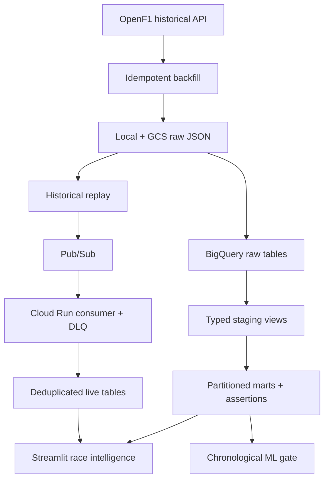

# F1 Race Intelligence

[](https://github.com/sampratsakhare/f1-race-intelligence/actions/workflows/ci.yml)

An end-to-end Formula 1 analytics platform built to demonstrate reliable data
ingestion, warehouse modeling, replayable event processing, decision-first
analytics, and honest ML evaluation on Google Cloud.

The project answers four questions:

1. How did each driver's final classified result differ from the starting grid?
2. How did clean-lap pace, consistency, and pit-stop context differ within a race?
3. Can a live-session pipeline recover safely from retries and duplicate delivery?
4. Does a pre-race model beat the starting grid on future races?

## Architecture



Historical replay is the default streaming demo because it is deterministic,
available every day, and uses the same event envelope as the live path. An
authenticated OpenF1 poller is also included for race weekends.

## What is engineered here

| Area | Implementation |
|---|---|
| API reliability | OAuth bearer support, two-window rate limiting, bounded retries, `Retry-After`, permanent-error fail-fast |
| Batch ingestion | Session-partitioned raw files, atomic writes, SHA-256 manifests, resume/force behavior, optional GCS upload |
| Warehouse | BigQuery raw tables, typed staging views, source grid/results, partitioned and clustered marts |
| Data quality | Grain, key, position, and pit-duration assertions that fail the transformation job |
| Event processing | Deterministic event IDs, endpoint-specific event time, durable watermarks, Pub/Sub push, retry/DLQ policy |
| Analytics | Race/season filters, grid-to-finish, pace/consistency, pit context, source coverage, live freshness |
| ML | Pre-race-only features, complete-race chronological holdout, grid baseline, promotion gate |
| Delivery | Streamlit and FastAPI containers, Terraform, Make targets, GitHub Actions, 70% coverage gate |

## Important modeling choices

- Grid and finishing positions come from OpenF1's `starting_grid` and
  `session_result` endpoints—not inferred from the first and last position
  event.
- Clean-lap metrics exclude pit-out laps and laps outside ±20% of the
  race-level median. The dashboard exposes this definition.
- Position movement immediately around a pit stop is descriptive. It is not
  presented as the causal impact of the stop.
- The model uses only information available before a race. Entire future races
  are held out. Promotion requires at least five test races, lower MAE than the
  starting-grid baseline, and a positive lower bound on a race-cluster
  bootstrap improvement interval.
- Evaluation metrics use drivers with a non-null classified finishing
  position. Unclassified DNF/DNS/DSQ rows remain available for prior-status
  features and are reported in target-coverage metadata.
- Pub/Sub is at-least-once. Deterministic IDs and read-time deduplication make
  replay and retry behavior safe; the project does not claim exactly-once
  delivery.

## Bundled model result

The reproducible 2024–2025 snapshot currently produces:

| Chronological holdout metric | Candidate | Starting-grid baseline |
|---|---:|---:|
| Mean absolute error | **2.70 positions** | 3.04 positions |
| Mean race-level Spearman | **0.741** | 0.708 |
| Top-three accuracy | 73.3% | 73.3% |

The candidate improves row-weighted MAE by 0.34 positions, or 11.3%, and wins
on MAE in 8 of the final 10 races. The 95% race-cluster bootstrap interval for
mean improvement is +0.02 to +0.93 positions, so it clears the promotion rule.
Classified target coverage is 89.2%: 103 DNF/DNS/DSQ rows without a source
finishing position are retained for prior-status features but excluded from
supervised metrics. These numbers describe this fixed snapshot, not guaranteed
future performance; `make demo-data` and `make train` make the result
rerunnable.

For the analyst narrative—not only the pipeline—see
[the 2024–2025 case study](docs/CASE_STUDY.md). It covers grid predictiveness,
team reliability, the detailed Yas Marina race, model interpretation, and the
limits of pit-stop comparisons.

## Repository map

```text
dashboard/
  app.py                         Streamlit UI
  data_access.py                 Bounded, parameterized BigQuery reads
infra/terraform/                 GCP APIs, GCS, BigQuery, Pub/Sub, DLQ,
                                 service accounts, Artifact Registry, Cloud Run
src/
  ingest/
    openf1_client.py             Auth, throttling, retry, normalization
    historical_backfill.py      Resumable historical extraction + manifests
    live_poller.py               Durable live polling + BigQuery writes
  load/
    bigquery_loader.py           Batch and live BigQuery loading
    load_historical_to_bq.py     Combined endpoint loads
    run_transformations.py       Ordered SQL execution + dry-run support
  sql/
    staging.sql                  Typed source contracts
    marts/                       Driver-race and pit-stop marts
    quality_checks.sql           Executable warehouse assertions
  stream/
    replay.py                    Event-time historical replay
    consumer_app.py              Authenticated Pub/Sub push consumer
  ml/
    train_model.py               Leakage-safe LightGBM evaluation and gate
tests/                           Unit and contract tests
docs/                            Metric dictionary, case study, runbook
```

## Quick start

Run the source-backed bundled demo without a GCP account:

```bash
git clone https://github.com/sampratsakhare/f1-race-intelligence.git
cd f1-race-intelligence

python -m venv .venv
source .venv/bin/activate
python -m pip install -r requirements-dev.txt

make check
make dashboard
```

With no `GCP_PROJECT_ID`, the app automatically uses the bundled 2024–2025
OpenF1 snapshot. It includes 48 Grand Prix results, detailed lap/pit context
for the 2025 Yas Marina race, a static replay leaderboard, and model metrics
from a 10-race chronological holdout. The UI labels this mode explicitly.

Rebuild the demo data from its source:

```bash
make demo-data
```

For the full warehouse path, use Python 3.12, a GCP project with billing and
BigQuery enabled, and
[Application Default Credentials](https://cloud.google.com/docs/authentication/provide-credentials-adc):

```bash
cp .env.example .env
# Fill in GCP_PROJECT_ID, BQ_DATASET, BQ_LOCATION, and GCS_BUCKET.

gcloud auth application-default login
```

Run the historical path:

```bash
make backfill YEARS="2023 2024 2025 2026"
make load
make transform
make train
make dashboard
```

`make transform` renders the `PROJECT.DATASET` SQL templates, runs staging
before marts, and then executes the warehouse assertions. `make train` reads
the mart directly from BigQuery; a CSV is optional, not required.

The starting grid is keyed by OpenF1's qualifying `session_key`; extraction
resolves that source and adds `_target_session_key` for the Grand Prix. This
avoids a silent empty-grid join and remains unambiguous on Sprint weekends.

## Reproducible live demo

Every historical session is stored as endpoint JSON under:

```text
data/raw/<year>/<meeting_key>/<session_key>/
```

Validate a replay locally without cloud writes:

```bash
python -m src.stream.replay \
  --session-key <SESSION_KEY> \
  --sink stdout \
  --max-events 100
```

Write the replay directly to the provisioned BigQuery live tables:

```bash
python -m src.stream.replay \
  --session-key <SESSION_KEY> \
  --sink bigquery \
  --speed 100
```

Or exercise the full Pub/Sub → Cloud Run → BigQuery path:

```bash
python -m src.stream.replay \
  --session-key <SESSION_KEY> \
  --sink pubsub \
  --speed 100
```

The Streamlit live tab refreshes every 10 seconds and shows event count,
source time, ingestion time, latency, latest lap, and the current leaderboard.

## Authenticated live polling

OpenF1 historical data from 2023 onward is free. Real-time data requires a
paid subscription and OAuth access token. Put the token in
`OPENF1_ACCESS_TOKEN`, then run:

```bash
python -m src.ingest.live_poller \
  --session-key latest \
  --poll-seconds 8
```

The poller maintains a durable watermark per session and endpoint. State is
advanced only after BigQuery confirms the write, so a failed insert is retried
instead of silently skipped.

See the [OpenF1 documentation](https://openf1.org/docs/) and
[authentication guide](https://openf1.org/auth.html) for current access rules.

## GCP deployment

Terraform uses a two-stage deployment so Artifact Registry exists before the
application images are pushed.

```bash
cd infra/terraform
cp terraform.tfvars.example terraform.tfvars
# Set project_id and a globally unique raw_bucket_name.

terraform init
terraform plan
terraform apply

REGISTRY="$(terraform output -raw artifact_registry_repository)"
cd ../..

gcloud auth configure-docker us-central1-docker.pkg.dev
docker build -f Dockerfile.consumer \
  -t "${REGISTRY}/event-consumer:$(git rev-parse --short HEAD)" .
docker build -f Dockerfile.dashboard \
  -t "${REGISTRY}/dashboard:$(git rev-parse --short HEAD)" .
docker push "${REGISTRY}/event-consumer:$(git rev-parse --short HEAD)"
docker push "${REGISTRY}/dashboard:$(git rev-parse --short HEAD)"
```

Set `deploy_services=true`, put both immutable image references in
`terraform.tfvars`, and apply again:

```bash
cd infra/terraform
terraform plan
terraform apply
```

The dashboard is private by default. Set `dashboard_public=true` only when a
public portfolio demo is intended. The event consumer remains restricted to
the Pub/Sub push identity.

## Validation

```bash
make check
```

CI runs:

- Ruff lint and formatting checks
- unit and contract tests
- a 70% coverage gate across application modules
- independent builds of the dashboard and consumer containers

Cloud credentials are deliberately not stored in GitHub. BigQuery SQL dry-run,
Terraform plan, replay smoke tests, and Cloud Run health checks should be run
in the target GCP project as deployment checks.

## Limitations and next experiments

- OpenF1 is an unofficial, community-operated source intended for
  non-commercial analysis; its source semantics and access model can change.
- The current candidate predicts pre-race finishing order. A separate lap-N
  forecast would need time-varying features, race-state snapshots, and
  evaluation at fixed laps.
- Pit-stop comparisons are observational. A strategy-effect estimate would
  require a counterfactual design that controls for traffic, tire age, safety
  cars, and pace.
- Batch orchestration is command-driven. A next production step would schedule
  backfill, load, transform, assertions, and model evaluation with Cloud
  Workflows or Composer.

## Data source and disclaimer

Data comes from [OpenF1](https://openf1.org/), which is not affiliated with
Formula 1, FIA, or Formula One Management. Historical coverage begins in 2023.
Review OpenF1's current terms and licensing before any use beyond education,
research, or non-commercial fan analysis.
